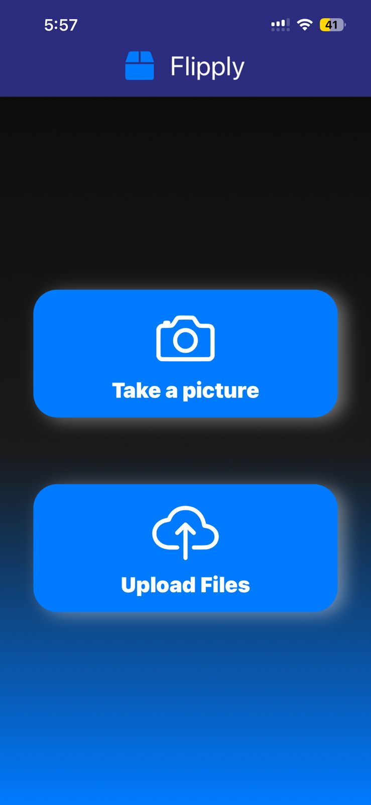
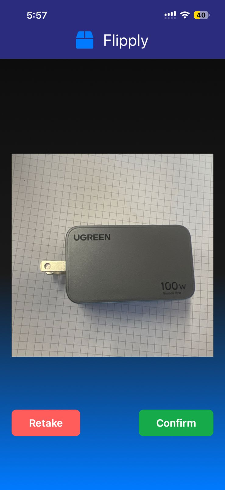
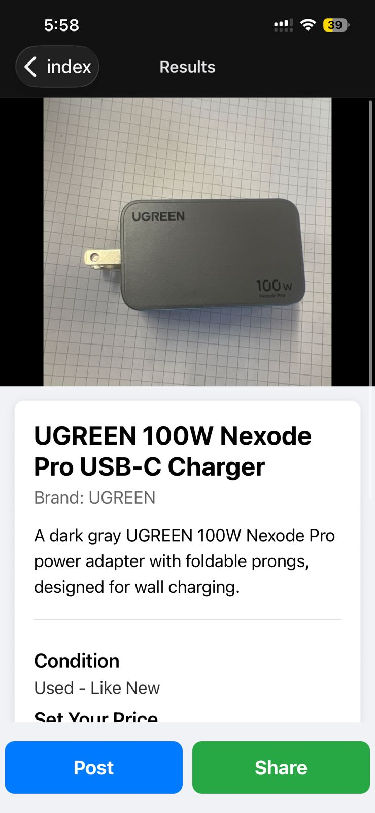
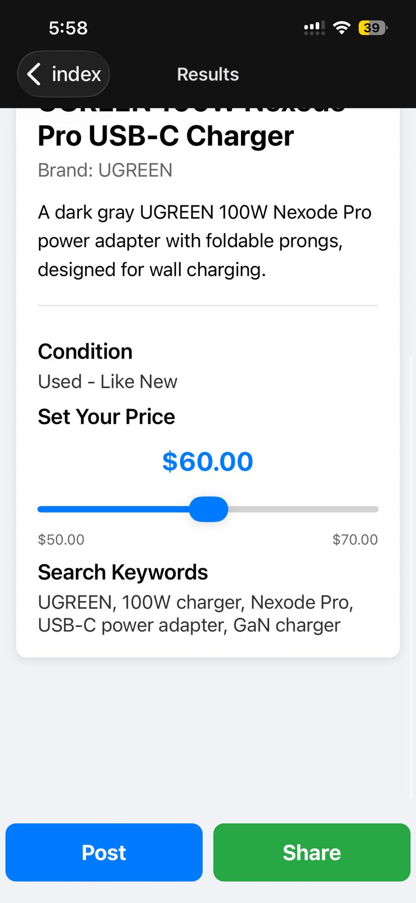
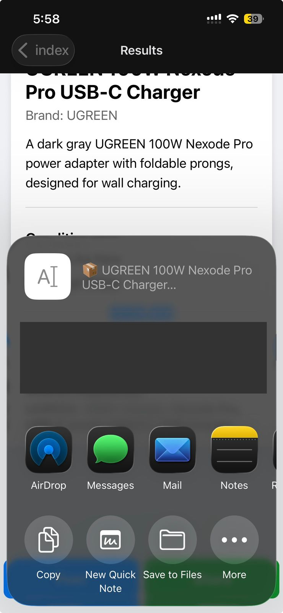

# HackHarvard - Flipply
* Imagine selling easily on E-Bay with a quick snap of a picture of that one item laying around your house. That´s Flipply.
* Our app lets you snap or upload a picture, where Gemini's vision AI identifies and describes the item, brand, and even connects to the eBay API to find real-time market prices. We make selling on eBay fast and easy with the most accurate price and description so no one can no longer make excuses on why that useless lamp is laying in their garage.  
* Beyond getting rid of home clustering, a higher incentive on e-commerce and extension of thousands of life cycles of products is being resolved, and, with faster logistics, Flipply moves more people and goods, powering our future.


  


## Tech & Langs
- Gemini API
- eBay API
- React
- Streamlit
- Python
- JavaScript
- TypeScript
- Github

## Features
*h

*h

*h

*h

## Streamlit Presentation
[www.flipplyflopllyEz-bay.com](https://hans27barron-hackharvardwebpage-home-zps34k.streamlit.app/)

## Video Demo
htttppspsps


## Get started

1. Install dependencies

   ```bash
   npm install
   ```

2. Start the app

   ```bash
   npx expo start
   ```

In the output, you'll find options to open the app in a

- [development build](https://docs.expo.dev/develop/development-builds/introduction/)
- [Android emulator](https://docs.expo.dev/workflow/android-studio-emulator/)
- [iOS simulator](https://docs.expo.dev/workflow/ios-simulator/)
- [Expo Go](https://expo.dev/go), a limited sandbox for trying out app development with Expo

You can start developing by editing the files inside the **app** directory. This project uses [file-based routing](https://docs.expo.dev/router/introduction).

## Get a fresh project

When you're ready, run:

```bash
npm run reset-project
```

This command will move the starter code to the **app-example** directory and create a blank **app** directory where you can start developing.

## Learn more

To learn more about developing your project with Expo, look at the following resources:

- [Expo documentation](https://docs.expo.dev/): Learn fundamentals, or go into advanced topics with our [guides](https://docs.expo.dev/guides).
- [Learn Expo tutorial](https://docs.expo.dev/tutorial/introduction/): Follow a step-by-step tutorial where you'll create a project that runs on Android, iOS, and the web.
